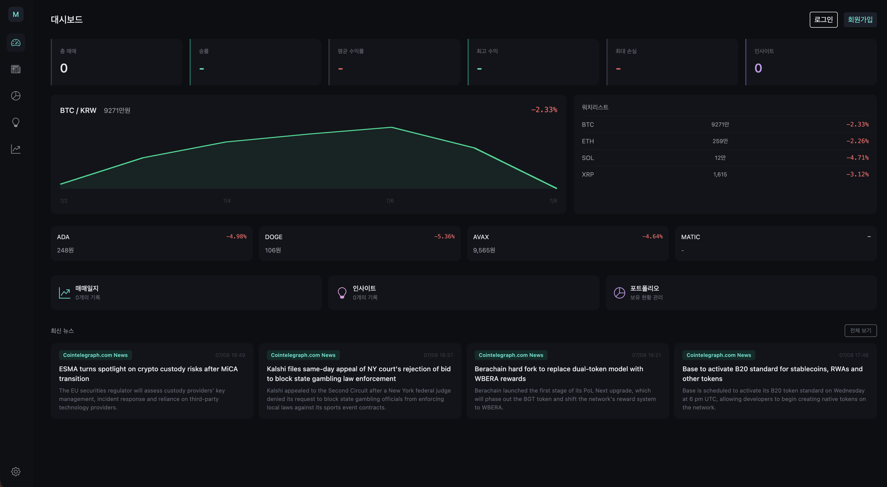

# myWeb Project


> 기획부터 개발·배포·운영까지 직접 진행하며 성장시키는 개인 웹 플랫폼

<br>



<br>

---

## Overview

혼자서 기획부터 개발·배포·운영까지 전 과정을 직접 진행하는 웹 서버 프로젝트다. Spring Boot 기반으로 서버를 구축한 뒤 계층형 아키텍처 정비와 DB 이관, 보안 강화를 거쳐 실서비스 형태(암호화폐 매매일지 플랫폼)로 발전시켰다.

지금은 **아키텍처 마이그레이션** 단계로, 기존 서버를 새로 만들지 않고 **브라운필드(Brownfield) 방식으로 고도화**하는 방향으로 전환했다 — 포트폴리오 웹사이트를 이 서버의 신규 도메인으로 통합하고, 프론트엔드/백엔드를 분리(React + REST API)하며, DB 운영 경험을 다각화하기 위해 관리형 AWS RDS 대신 자체 구축 MySQL로 옮기는 작업을 진행 중이다. 자세한 진행 배경과 기술적 의사결정은 [docs/architecture-migration-log.md](docs/architecture-migration-log.md)에 기록한다.

<br>

---

## Tech Stack

| 분류 | 기술 | 상태 |
| :--- | :--- | :---: |
| Language | Java 21 | 완료 |
| Framework | Spring Boot 4.0.0 · Spring Data JPA · Spring Security | 완료 |
| View (레거시) | Thymeleaf · Bootstrap 5 | 완료 → React로 대체 예정 |
| Frontend (신규) | React _(placeholder)_ | 예정 |
| Database | H2(로컬, 레거시) · AWS RDS MySQL(운영, 레거시) · 자체 구축 MySQL(로컬 개발) | 진행 중 |
| Deployment (레거시) | AWS EC2 · Nginx | 완료 → 자체 호스팅으로 전환 예정 |
| Deployment (신규) | 자체 소유 하드웨어 + Cloudflare Tunnel _(placeholder)_ | 예정 |
| Build | Maven | 완료 |

레거시 항목은 서버 구축~서비스 확장 단계에서 쓰인 스택이고, 신규 항목은 아키텍처 마이그레이션 단계에서 도입 중인 스택이다. 자세한 진행 상황은 [docs/architecture-migration-log.md](docs/architecture-migration-log.md) 참고.

<br>

---

## Project Milestone

### 1. 서버 구축

| 단계 | 내용 | 상태 |
| :--- | :--- | :---: |
| Step 1 | 개발 환경 구성 (JDK, IDE, Spring Boot 초기화) | ✅ |
| Step 2 | DB 엔지니어링 (H2, JPA, Entity/Repository 구성) | ✅ |
| Step 3 | UI/UX 엔지니어링 (Thymeleaf, Bootstrap) | ✅ |
| Step 4 | 시스템 관리 (AWS EC2, Elastic IP, 도메인) | ✅ |
| Step 5 | 보안 엔지니어링 (Nginx, HTTPS, Let's Encrypt) | ✅ |

### 2. 유지보수 및 운영

| 단계 | 내용 | 상태 |
| :--- | :--- | :---: |
| Step 1 | 기능 및 코드 관리 (계층형 아키텍처, 검색, 파일 업로드) | ✅ |
| Step 2 | 데이터 관리 (MySQL 이관, RDS 백업) | ✅ |
| Step 3 | 사용자 인증 및 접근 제어 (Spring Security) | ✅ |
| Step 4 | 인프라 유지보수 (CI/CD, 로그 관리) | ✅ |

### 3. 보안 강화

| 단계 | 내용 | 상태 |
| :--- | :--- | :---: |
| Step 1 | Service 레이어 권한 검증 | ✅ |
| Step 2 | Rate Limiting · XSS / CSRF 방어 | ✅ |
| Step 3 | 민감정보 외부화 (환경변수 / Secrets Manager) | ✅ |
| Step 4 | 컨트롤러 보안 테스트 | ✅ |

### 4. 서비스 확장 (매매일지 플랫폼)

| 단계 | 내용 | 상태 |
| :--- | :--- | :---: |
| Step 1 | 다크 테마 · 대시보드 레이아웃 전환 | ✅ |
| Step 2 | 콘텐츠 타입 분리 (TRADE\_LOG / INSIGHT) + DB 스키마 | ✅ |
| Step 3 | 매매일지 CRUD | ✅ |
| Step 3.5 | 푸시 패널 분할 레이아웃 (사이드바 → 패널 슬라이드인) | ✅ |
| Step 3.6 | 폼 가운데 정렬 · 사이드바 설정 오버레이 | ✅ |
| Step 4 | 실시간 시세 (업비트 API) + 뉴스 자동 수집 (RSS) | ✅ |
| Step 4-B | 포트폴리오 직접 입력 (보유 현황 · 평가손익) | ✅ |
| Step 4-C | 뉴스 내부 상세보기 + AI 한국어 요약 (Groq / Llama) | ✅ |
| Step 4-D | 번역 비동기 분리 (RSS 수집↔번역 스케줄러 분리) + H2 파일 DB 전환 | ✅ |
| Step 5 | 마크다운 에디터 (EasyMDE + Flexmark) | ⬜ |
| Step 5 | 공개 / 비공개 설정 | ⬜ |
| Step 6 | 대시보드 (통계 뷰) | ⬜ |

### 5. 아키텍처 마이그레이션 (포트폴리오 통합 · API 현대화, 진행 중)

| 단계 | 내용 | 상태 |
| :--- | :--- | :---: |
| Step 1 | 로컬 개발 DB 전환 (H2 → 자체 구축 MySQL) | ✅ |
| Step 2 | Flyway 도입 (스키마 버전 관리) | ⬜ |
| Step 3 | 기존 Controller REST API 전환 | ⬜ |
| Step 4 | React 프론트엔드 구축 및 포트폴리오 통합 | ⬜ |
| Step 5 | 자체 호스팅 배포 (Cloudflare Tunnel) | ⬜ |

<br>

---

## Quick Start

```bash
cd my-server
mvn spring-boot:run
```

접속 → http://localhost:8081

운영 서버 배포 → [docs/deploy.md](docs/deploy.md)

<br>

---

## Documentation

| 문서 | 내용 |
| :--- | :--- |
| [docs/study-notes.md](docs/study-notes.md) | 핵심 개념 정리 (아키텍처 · DB · 보안 — 서버 구축~보안 강화 경험 기반) |
| [docs/deploy.md](docs/deploy.md) | 배포 및 운영 절차 (서버 구축~서비스 확장 단계 기준) |
| [docs/architecture-migration-log.md](docs/architecture-migration-log.md) | 아키텍처 마이그레이션 진행 기록 (결정 이유 + 진행 상황, 계속 갱신) |
